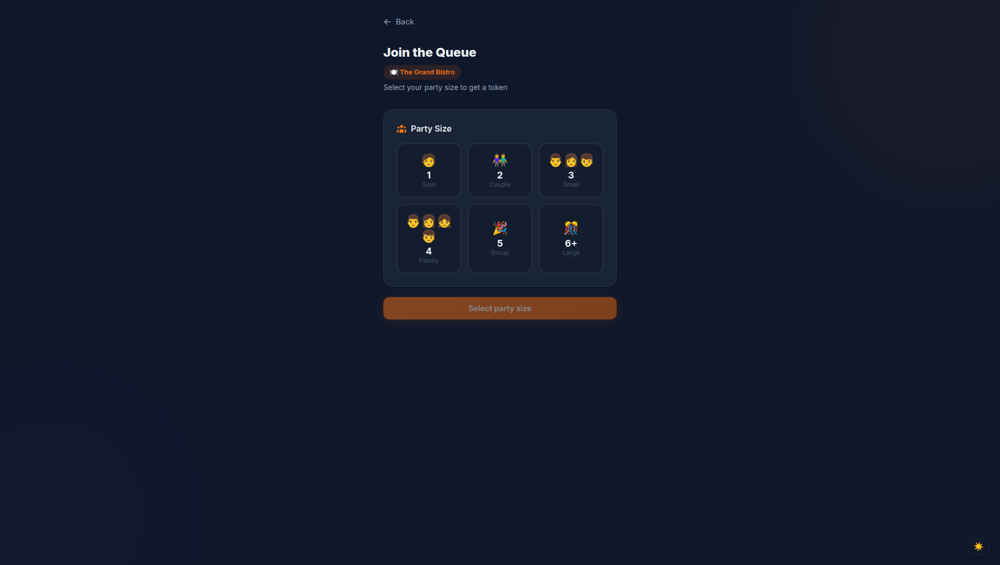
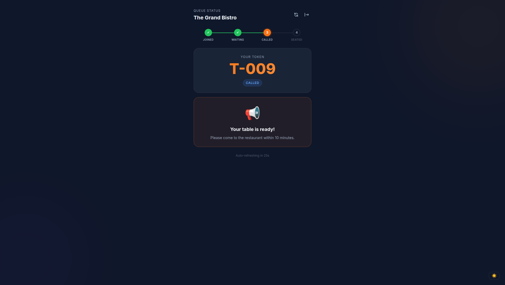
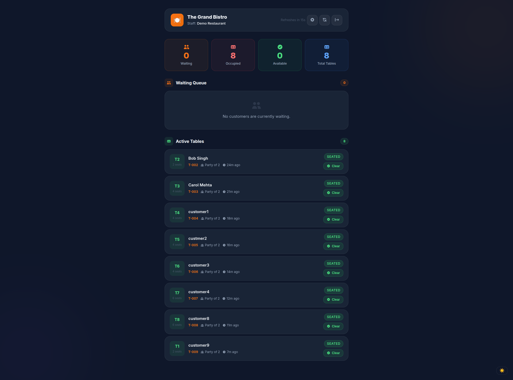
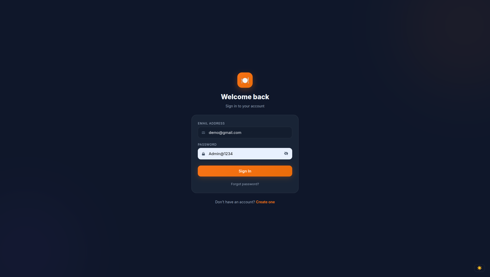
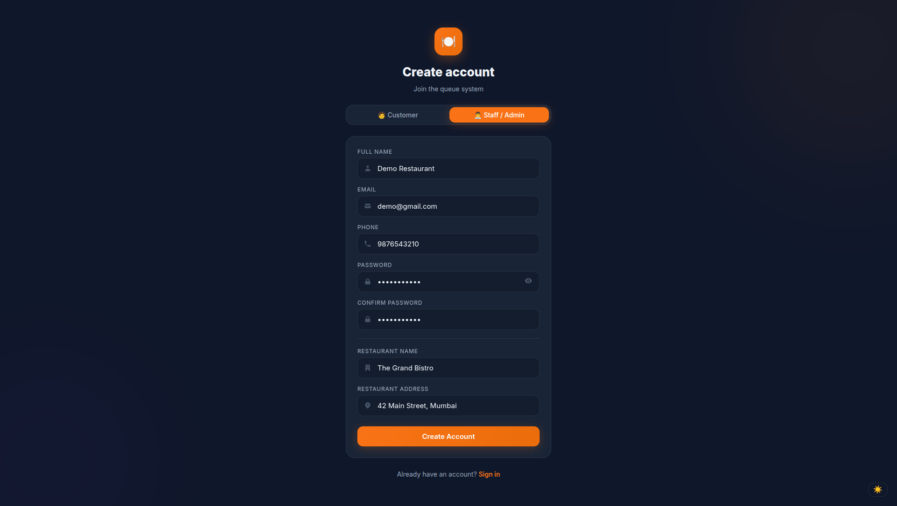
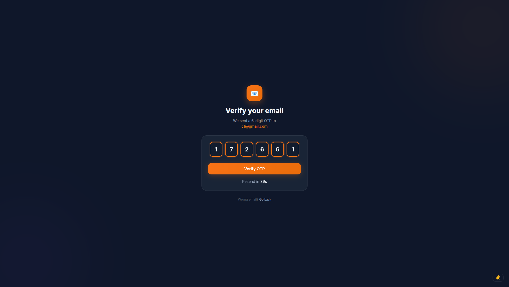

# 🍽️ Restaurant Queue Management System


A full-stack virtual queue management system for restaurants. Customers join a queue from their phone, track their position in real-time, and get notified when their table is ready — no physical waiting in line.

> **Live demo:** *(coming soon)* &nbsp;|&nbsp; **Backend:** Django REST Framework &nbsp;|&nbsp; **Frontend:** React 19

---

## 📸 Screenshots

> Add screenshots to a `docs/screenshots/` folder and update the paths below.

| Customer — Join Queue | Customer — Queue Status | Admin — Staff Dashboard |
|---|---|---|
|  |  |  |

| Login | Register | OTP Verification |
|---|---|---|
|  |  |  |

---

## 🧩 Problem Statement

Restaurants face crowd congestion at peak hours. Customers standing in physical lines don't know:
- How long they will wait
- What their position is in the queue
- When their turn is coming

This system replaces the physical line with a smart virtual queue. Customers wait anywhere — at their car, nearby, or at the bar — and are called only when their table is ready.

---

## ✨ Features

### Customer-Facing
- Join a virtual queue by selecting party size
- Receive a unique token (T-001, T-002…) per visit
- See live queue position and estimated wait time
- Get notified when called to the table
- Leave the queue from their phone at any time
- Submit feedback after visit completion

### Staff / Admin
- Real-time staff dashboard — waiting queue + active tables in one view
- Call the next customer with one tap
- Seat a called customer (waiting → called → seated lifecycle)
- Clear a table with one tap — next customer is auto-called
- Auto no-show detection — if a called customer doesn't arrive within 10 minutes, Celery marks them as no-show and frees the table automatically
- Wait times recalculate for all waiting customers after every queue change
- Table management — add, edit, and delete tables from the dashboard
- Order management — create orders per table, track item status (kitchen view)

### System
- Best-fit table allocation algorithm (party of 3 gets a 4-seater, not a 6-seater)
- Separate queues by party size (small / medium / large)
- JWT authentication with OTP email verification
- Password reset via OTP email
- Refresh token rotation with server-side blacklisting
- Background task processing with Celery + Redis
- Dark / light mode UI with localStorage persistence
- 60 automated tests — all passing

---

## 🏗️ Architecture Overview

```
┌─────────────────────────────────────────────────────────────┐
│                        React Frontend                        │
│  AuthContext · ThemeContext · Axios (JWT interceptor)        │
│  Customer Pages: Home → JoinQueue → QueueStatus             │
│  Admin Pages: Dashboard (queue + active tables)             │
└────────────────────────┬────────────────────────────────────┘
                         │ HTTP / REST
┌────────────────────────▼────────────────────────────────────┐
│                   Django REST Framework                      │
│  accounts/   → Auth, OTP, JWT                               │
│  restaurants/→ Restaurant, TableUnit                        │
│  queue_manager/ → QueueEntry, TableAssignment, services     │
│  orders/     → MenuItem, OrderRecord                        │
│  notifications/ → NotificationLog, Feedback                 │
└──────────┬──────────────────────────┬───────────────────────┘
           │                          │
┌──────────▼──────────┐   ┌──────────▼──────────────────────┐
│      MySQL 8.0      │   │     Redis + Celery               │
│  Persistent data    │   │  check_no_shows (periodic task)  │
│  select_for_update  │   │  auto-call next after no-show    │
│  @transaction.atomic│   └─────────────────────────────────┘
└─────────────────────┘
```

### Key Design Decisions

| Decision | Rationale |
|---|---|
| `@transaction.atomic` + `select_for_update` on every state write | Prevents double-call and double-seat race conditions under concurrent requests |
| Best-fit table allocation | Preserves larger tables for larger parties, maximising throughput |
| Separate queues by party size | A party of 2 never competes with a party of 6 for the same table |
| Celery periodic task for no-shows | Decouples timeout logic from the request cycle; no polling needed on the server |
| CSPRNG for OTP generation (`secrets` module) | Prevents predictable OTP attacks |
| Server-side refresh token blacklist | Logout is enforced server-side, not just client-side |

---

## 🗄️ Database Schema

```
Restaurant
  ├── TableUnit          (capacity, is_available)
  │     └── TableAssignment  (who is/was seated, timestamps)
  ├── QueueEntry         (token, party_size, status, wait_time)
  │     ├── TableAssignment
  │     ├── NotificationLog
  │     └── Feedback
  └── MenuItem
        └── OrderItem → OrderRecord
```

### Queue Entry Status Lifecycle

```
join_queue
    │
    ├─ table available? ──YES──► seated (immediate, skips called)
    │
    └─ NO ──► waiting
                │
              call_customer
                │
              called  ◄──── 10-min window (Celery watches)
                │                │
              seat_customer    timeout
                │                │
              seated          no_show ──► table freed ──► next customer auto-called
                │
              clear_table
                │
              completed
```

---

## 🔌 API Reference

### Auth — `/api/auth/`

| Method | Endpoint | Auth | Description |
|---|---|---|---|
| POST | `/admin/register/` | Public | Register as restaurant admin |
| POST | `/customer/register/` | Public | Register as customer |
| POST | `/verify-otp/` | Public | Activate account with OTP |
| POST | `/login/` | Public | Login → JWT access + refresh tokens |
| POST | `/resend-otp/` | Public | Resend OTP to email |
| POST | `/token/refresh/` | Refresh token | Rotate access token |
| POST | `/token/blacklist/` | Refresh token | Server-side logout |
| GET | `/profile/` | JWT | Current user profile |
| POST | `/request-password-reset/` | Public | Send password reset OTP |
| POST | `/reset-password/` | Public | Reset password with OTP |

### Queue — `/api/queue/`

| Method | Endpoint | Auth | Description |
|---|---|---|---|
| POST | `/join-queue/` | Public | Join queue with party size |
| GET | `/queue-status/<token>/` | Public | Live position + wait time |
| POST | `/leave-queue/` | Public | Leave queue voluntarily |
| GET | `/staff-dashboard/<id>/` | Admin | Waiting queue + active tables |
| POST | `/call-customer/` | Admin | Call next waiting customer |
| POST | `/seat-customer/` | Admin | Confirm customer is seated |
| POST | `/clear-table/` | Admin | Mark visit complete, free table |
| GET | `/my-active-queue/` | Customer | Customer's current active entry |

### Restaurants — `/api/restaurants/`

| Method | Endpoint | Auth | Description |
|---|---|---|---|
| GET | `/` | Public | List all active restaurants |
| GET | `/<id>/` | Public | Restaurant detail + table counts |
| GET | `/<id>/tables/` | Admin | List tables for restaurant |
| POST | `/<id>/tables/bulk-create/` | Admin | Bulk create tables |
| PATCH | `/tables/<id>/` | Admin | Update table capacity |
| DELETE | `/tables/<id>/` | Admin | Delete a table |

### Orders — `/api/orders/`

| Method | Endpoint | Auth | Description |
|---|---|---|---|
| GET | `/menu/<id>/` | Public | Restaurant menu |
| POST | `/create/` | Admin | Create order for a table |
| GET | `/<id>/` | Admin | Order detail |
| PATCH | `/<id>/status/` | Admin | Update order status |
| PATCH | `/item/<id>/status/` | Admin | Update individual item status |
| GET | `/table/<id>/` | Admin | All orders for a table |
| GET | `/restaurant/<id>/active/` | Admin | Active orders (kitchen view) |

### Notifications — `/api/notifications/`

| Method | Endpoint | Auth | Description |
|---|---|---|---|
| POST | `/feedback/` | Customer | Submit post-visit feedback |
| GET | `/feedback/restaurant/<id>/` | Admin | All feedback for restaurant |
| GET | `/logs/<id>/` | Admin | SMS notification logs |

---

## 🔐 Authentication Flow

```
Register (admin or customer)
    ↓
OTP sent to email  [generated with secrets.randbelow — CSPRNG]
    ↓
Verify OTP → account activated
    [Admin only: Restaurant + 8 default tables auto-created]
    ↓
Login → JWT access token (12h) + refresh token (7d)
    ↓
On 401 → Axios interceptor auto-refreshes once → retries request
    ↓
Logout → POST /api/auth/token/blacklist/ → localStorage cleared
```

---

## ⚙️ Queue Logic

### Party Size → Table Size Mapping
```
Small  (1–2 people) → 2-seater tables only
Medium (3–4 people) → 4-seater tables only
Large  (5+ people)  → 6-seater tables only
```

### Wait Time Estimation
```
rounds    = ceil(people_ahead / occupied_tables_of_same_type)
wait_time = rounds × average_meal_duration
```

### Best-Fit Allocation
```
Party of 3 arrives. Available: 2-seater, 4-seater, 6-seater
→ System assigns 4-seater (smallest table that fits)
→ 6-seater preserved for larger parties
```

---

## 🛠️ Tech Stack

### Backend
| Technology | Version | Purpose |
|---|---|---|
| Python | 3.10 | Language |
| Django | 5.2 | Web framework |
| Django REST Framework | 3.17 | API layer |
| MySQL | 8.0 | Primary database |
| Redis | 7.x | Celery message broker |
| Celery | 5.6 | Background task processing |
| Django Celery Beat | 2.9 | Periodic task scheduling |
| djangorestframework-simplejwt | 5.5 | JWT auth + token blacklist |
| python-decouple | 3.8 | Environment variable management |
| Twilio | 8.x | SMS notifications (optional) |

### Frontend
| Technology | Version | Purpose |
|---|---|---|
| React | 19 | UI framework |
| React Router | v7 | Client-side routing |
| Axios | latest | HTTP client + JWT refresh interceptor |
| CSS Custom Properties | — | Dark/light theme system |

---

## 🚀 Installation

### Prerequisites
- Python 3.10+
- Node.js 18+
- MySQL 8.0
- Redis

### 1. Clone the repository

```bash
git clone https://github.com/rohit2002yadav/restaurant-queue-system.git
cd restaurant-queue-system
```

### 2. Backend setup

```bash
# Create and activate virtual environment
python -m venv venv
source venv/bin/activate          # Windows: venv\Scripts\activate

# Install dependencies
pip install -r requirements.txt

# Create MySQL database
mysql -u root -p <<EOF
CREATE DATABASE restaurant_queue_db CHARACTER SET utf8mb4 COLLATE utf8mb4_unicode_ci;
CREATE USER 'queue_user'@'localhost' IDENTIFIED BY 'YourPassword';
GRANT ALL PRIVILEGES ON restaurant_queue_db.* TO 'queue_user'@'localhost';
FLUSH PRIVILEGES;
EOF

# Configure environment
cp .env.example .env
# Edit .env with your values (see Environment Variables section)

# Run migrations
python manage.py migrate

# (Optional) Seed sample data
python manage.py seed_data

# Start server
python manage.py runserver
```

### 3. Frontend setup

```bash
cd ../restaurant-frontend
npm install
cp .env.example .env          # Set REACT_APP_API_URL=http://127.0.0.1:8000
npm start
```

### 4. Background workers (3 terminals)

```bash
# Terminal 2 — Celery worker
source venv/bin/activate
celery -A config worker --loglevel=info

# Terminal 3 — Celery beat (no-show scheduler)
source venv/bin/activate
celery -A config beat --loglevel=info
```

---

## 🔧 Environment Variables

### Backend (`.env`)

| Variable | Default | Description |
|---|---|---|
| `SECRET_KEY` | — | Django secret key |
| `DEBUG` | `True` | Debug mode — set `False` in production |
| `DB_NAME` | `restaurant_queue_db` | MySQL database name |
| `DB_USER` | `queue_user` | MySQL username |
| `DB_PASSWORD` | — | MySQL password |
| `DB_HOST` | `localhost` | MySQL host |
| `DB_PORT` | `3306` | MySQL port |
| `CORS_ALLOW_ALL_ORIGINS` | `True` | Set `False` in production |
| `CORS_ALLOWED_ORIGINS` | `http://localhost:3000` | Allowed frontend origins (production) |
| `REDIS_URL` | `redis://127.0.0.1:6379/0` | Redis connection URL |
| `EMAIL_HOST_USER` | — | SMTP email address |
| `EMAIL_HOST_PASSWORD` | — | SMTP password |
| `SMS_ENABLED` | `False` | Enable Twilio SMS |
| `TWILIO_ACCOUNT_SID` | — | Twilio account SID |
| `TWILIO_AUTH_TOKEN` | — | Twilio auth token |
| `TWILIO_PHONE_NUMBER` | — | Twilio sender number |

### Frontend (`.env`)

| Variable | Default | Description |
|---|---|---|
| `REACT_APP_API_URL` | `http://127.0.0.1:8000` | Django backend base URL |

---

## 🧪 Testing

```bash
# Run all 60 tests
python manage.py test

# Run a specific app
python manage.py test queue_manager
python manage.py test accounts
```

Test coverage includes:
- Queue join, call, seat, clear, leave, no-show lifecycle
- Race condition safety (double-call, double-seat, double-clear)
- OTP generation and verification
- JWT authentication and token blacklisting
- Wait time recalculation
- Best-fit table allocation

---

## 📁 Project Structure

```
new_django_project/          ← Django backend
├── config/
│   ├── settings.py          ← All configuration (env-driven)
│   ├── urls.py              ← Root URL routing
│   └── celery.py            ← Celery app setup
├── accounts/                ← User model, OTP, JWT auth, password reset
├── restaurants/             ← Restaurant + TableUnit models
├── queue_manager/           ← Core queue logic
│   ├── models.py            ← QueueEntry, TableAssignment
│   ├── services.py          ← All business logic (atomic transactions)
│   ├── tasks.py             ← Celery: check_no_shows
│   ├── views.py             ← API views + permission enforcement
│   ├── serializers.py       ← Request/response validation
│   └── urls.py              ← Queue API routes
├── orders/                  ← Menu + order management
├── notifications/           ← SMS logs + customer feedback
├── .env.example             ← Environment variable template
└── requirements.txt

restaurant-frontend/         ← React frontend
└── src/
    ├── api/axios.js         ← Axios instance + JWT interceptors + all API calls
    ├── context/
    │   ├── AuthContext.js   ← Auth state, login, logout (blacklists token)
    │   └── ThemeContext.js  ← Dark/light mode, persisted to localStorage
    ├── pages/
    │   ├── auth/            ← Login, Register, VerifyOTP, ForgotPassword, ResetPassword
    │   ├── customer/        ← CustomerHome, JoinQueue, QueueStatus, CustomerFeedback
    │   └── admin/           ← AdminDashboard, RestaurantSetup, TableManagement
    └── styles/theme.css     ← CSS custom properties for theming
```

---

## 🗺️ Frontend Routes

| Route | Access | Page |
|---|---|---|
| `/` | Public | Landing page |
| `/login` | Public | Email + password login |
| `/register` | Public | Register as admin or customer |
| `/verify-otp` | Public | 6-digit OTP verification |
| `/forgot-password` | Public | Request password reset OTP |
| `/reset-password` | Public | Reset password with OTP |
| `/customer/home` | Customer | Dashboard + join queue CTA |
| `/customer/join` | Customer | Party size selector |
| `/customer/status` | Customer | Live queue position + leave queue |
| `/customer/feedback` | Customer | Post-visit feedback form |
| `/admin/dashboard` | Admin | Waiting queue + active tables |
| `/admin/setup` | Admin | Restaurant setup wizard |
| `/admin/tables` | Admin | Table management |

---

## 🔮 Future Improvements

- [ ] WebSocket real-time updates (replace polling)
- [ ] QR code generation per restaurant
- [ ] SMS notifications via Twilio (infrastructure ready, `SMS_ENABLED=False`)
- [ ] Analytics dashboard — peak hours, no-show rate, average wait trends
- [ ] React Native mobile app

---

## 👤 Author

**Rohit Yadav**

[](https://github.com/rohit2002yadav)

---

## 📄 License

This project is developed for educational and portfolio purposes.
